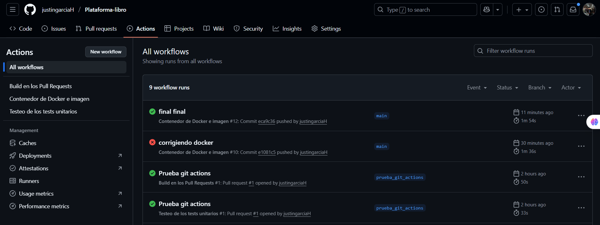
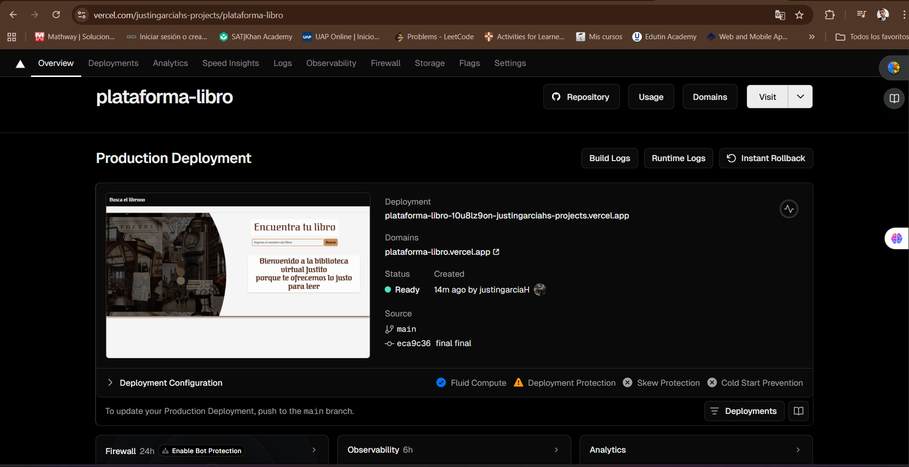

# URL de la aplicación deployada funcionando correctamente

Aplicacion deployada en: 
https://plataforma-libro.vercel.app/

# Repositorio GitHub con el código y los workflows configurados

https://github.com/justingarciaH/Plataforma-libro

# Cómo hacer el deploy local

    1. Clonar el repositorio:
    
    git clone https://github.com/justingarciaH/ Plataforma-libro.git
    cd Plataforma-libro

    npm install

    npm run dev

    abrí en el navegador:

    http://localhost:3000

# Cómo funcionan los GitHub Actions

Se configuraron los siguientes workflows:

Build en Pull Requests

Se ejecuta automáticamente al abrir un Pull Request.

Instala las dependencias y buildtea la aplicación.

Si el build falla, el PR queda marcado como fallido.

Tests en Pull Requests

Ejecuta todos los tests unitarios automáticamente en cada PR.

Si algún test falla, el PR queda marcado como fallido.

Docker Container en main

Se ejecuta al hacer push a la rama main.

Construye una imagen Docker optimizada de la aplicación.

Publica la imagen en GitHub Container Registry (ghcr.io).

# Variables de entorno necesarias

API_DEPLOYADA_URL = https://plataforma-libro.vercel.app/

API_GOOGLE_BOOKS =https://www.googleapis.com/books/v1/volumes/

 Estas variables se deben configurar tanto para el desarrollo local como para el deploy en Vercel o en Docker.

# Instrucciones para ejecutar con Docker

docker build -t justingarciah/plataforma-libro:latest .

docker run -p 3000:3000 justingarciah/plataforma-libro:latest

http://localhost:3000

# Demostración de que los GitHub Actions funcionan correctamente

Los workflows se ejecutan automáticamente en GitHub Actions según la configuración descrita arriba.

Cada ejecución queda registrada y se puede revisar en la pestaña Actions del repositorio.

Build y tests fallidos marcan automáticamente el PR como fallido.

El workflow de Docker construye y publica la imagen al hacer push en main.

captura de api deployada 
